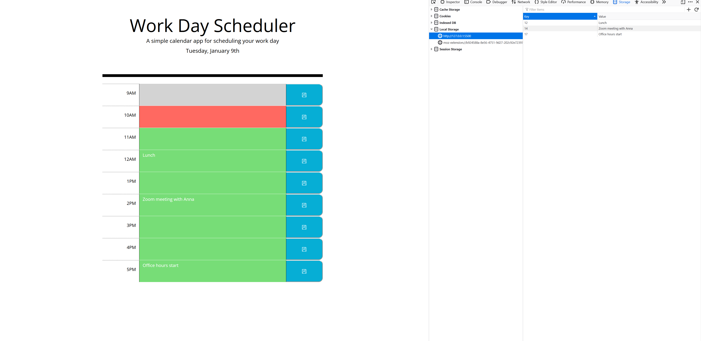

# daily-tasks-scheduler

# Table of content

[Overview](#Overview)
[Screenshots](#Screenshots)
[Links](#Links)
[My_process](#My_process)
[Built_with](#Built_with)
[What_I_learned](#What_I_learned)
[Continued_developement](#Continued_developement)
[Author](#Author)
[Sources](#Sources)

# Overview
The app should:
-Display the current day at the top of the calender when a user opens the planner.
-Present time blocks for standard business hours when the user scrolls down.
-Color-code each time block based on past, present, and future when the time block is viewed.
-Allow a user to enter an event when they click a time block
-Save the event in local storage when the save button is clicked in that time block.
-Persist events between refreshes of a page
I finished the challenge using jQuery and events around local storage.

## Screenshots

[show open page with task and time slots with different colors](./assets/images/daily-shedules-and-color-schemes.png)

### Links
the github page of the solutin[https://github.com/hszilvi/daily-tasks-scheduler]
live link[https://hszilvi.github.io/daily-tasks-scheduler/]

## My_process
At first I created the HTML file with all the rows. But I struggeld to manipulate elements correctly so decided to create html dynamically in js. 
It was challenging to save data into local storage, as I was supposed to use jQuery. But now I have a deep understanding using 'this' and manipulate data using 'children'/'siblings' in jQuery. 
Using multiple keys in local storage is not a common solution it was difficult to find help on internet. 

### Built_with
Javascript, jQuery, dayjs, VS code

## What_I_learned
I learned a lot about jQuery, Local Storage.

### Continued_developement
local storage, jQuery methods

## Author
Szilvia Horvath
GitHub[https://github.com/hszilvi]
LinkedIn[https://www.linkedin.com/in/horvathszilvi/]

# Sources
<!-- bootstrap floppy icon / i + svg is needed -->
https://icons.getbootstrap.com/icons/floppy/
<!-- local storage -->
https://blog.logrocket.com/localstorage-javascript-complete-guide/
<!-- loop through local storage if I have multiple keys with syntax I needed!!!-->
https://attacomsian.com/blog/javascript-iterate-over-local-storage-keys
https://discourse.webflow.com/t/how-to-populate-a-fied-in-form-based-on-data-from-collection-item/118788
https://stackoverflow.com/questions/41653559/im-trying-to-get-a-variable-from-my-main-page-to-the-admin-panel

